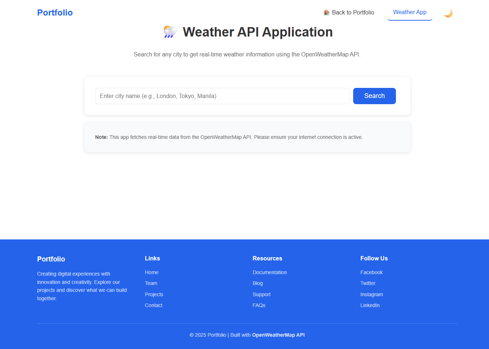

# 🌦️ Weather Checker

A simple and responsive **Weather Application** that displays real-time weather information using the [OpenWeatherMap API](https://openweathermap.org/api).  
Built with **HTML**, **CSS**, and **JavaScript**, this project demonstrates API integration, error handling, and user-friendly design.

---

## 🖼 Project Preview

### 🌐 Full Page Screenshot


### ☁️ Weather App Screenshot



---

## 🚀 Features

- 🌦 **Real-Time Weather Data** — Get live weather updates by city name.  
- ⚡ **Error Handling** — Displays friendly messages for no internet, invalid city names, or failed API requests.  
- 🌓 **Light & Dark Mode** — Easily toggle between themes.  
- 📱 **Responsive Design** — Works beautifully across all devices.  
- 🧭 **Smooth Navigation** — Animated scrolling and active link highlighting.  

---

## ⚙️ How to Run Locally

1. **Download or Clone** this repository:
   ```bash
   git clone https://github.com/YourUsername/Weather-Checker.git
